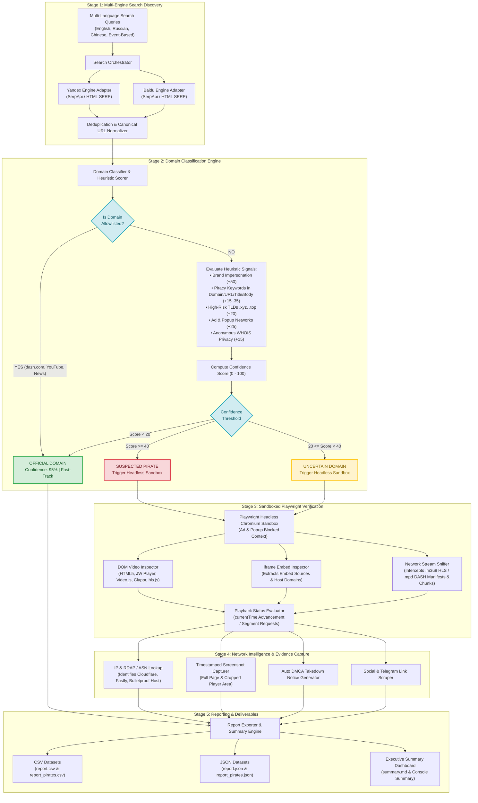

## 1. System Architecture Overview

The Anti-Piracy Discovery & Verification System is designed as a modular, end-to-end automated pipeline to discover illegal live streams across regional search engines (Yandex & Baidu), classify domain legitimacy, verify active video playback in a sandboxed headless browser, and produce legally enforceable evidence packages for takedown notices.

### System Flow Diagram



---

## 2. Key Modules & Design Decisions

### Module 1: Search Discovery (`discovery/`)
- **Multi-Engine Support:** Integrates Yandex (Russia/CIS focus) and Baidu (China focus).
- **Adaptability:** Operates via SerpApi (when `SERPAPI_API_KEY` is present), direct SERP HTML scraping, or built-in fallback parser to handle search engine anti-bot challenges gracefully.
- **Deduplication:** Aggregates multi-language query results and deduplicates by canonical URL structure and domain name to prevent redundant verification.

### Module 2: Domain Classification (`classification/`)
- **Allowlist Filtering:** Checks candidate domains against an extensible allowlist (`dazn.com`, `kayosports.com.au`, `foxtel.com.au`, `binge.com.au`, official social accounts, app stores, Wikipedia, and verified media news sites).
- **Heuristic Scoring Model (0-100):** Evaluates non-allowlisted domains based on:
  - Brand Impersonation (e.g., `dazn-live.xyz`, `watchdazn.com`): **+50 pts**
  - High-Risk TLDs (`.xyz`, `.top`, `.stream`, `.cc`, `.ru`, `.cn`): **+20 pts**
  - Piracy Keywords in Domain / URL / Title / Snippet (`free`, `stream`, `iptv`, `zhibo`, `m3u8`): **+15 to +35 pts**
- **Classification Thresholds:**
  - `Confidence >= 40`: **Pirate**
  - `Confidence 20-39`: **Uncertain**
  - `Confidence < 20`: **Official**
- **Network Intelligence (Bonus):** Performs IP resolution and RDAP/ASN lookup (e.g. Cloudflare, Fastly, bulletproof host identification) for takedown routing.

### Module 3 & 4: Playwright Video Player Detection & Evidence (`detection/`, `evidence/`)
- **Sandboxed Execution:** Headless Chromium instance blocks known pop-up / ad networks for security and speed.
- **Player Types Detected:** HTML5 `<video>`, iframe embeds (`vidsrc`, `streamtape`, etc.), and JS player libraries (`JW Player`, `Video.js`, `Clappr`, `hls.js`, `Flowplayer`, `Plyr`).
- **Network Stream Sniffing:** Intercepts outgoing request traffic to detect `.m3u8` (HLS) and `.mpd` (DASH) live streaming manifests during page render.
- **Playback Validation:** Measures `currentTime` advancement over time or presence of active streaming manifest segments to distinguish between `Player Present - Not Playing` vs `Player Present - Playing`.
- **Evidence Capture:** Takes full-page and cropped player screenshots with UTC timestamping, extracts primary stream URLs, generates DMCA notices, and identifies associated Telegram link channels.

---

## 3. High-Throughput Scaling Architecture (1,000+ URLs in 2 Hours)

To process **1,000+ URLs within 2 hours (~8-9 URLs/sec)**, the pipeline implements a production-grade distributed architecture powered by **Celery** worker pools and **Redis** for in-memory queueing and deduplication caching:

```
[SERP Discovery Orchestrator] ──> [Redis Task Queue (DB 0)] ──> [Celery Worker Cluster (10-20 Nodes)]
                                                                          │
                                                           ┌──────────────┴──────────────┐
                                                           ▼                             ▼
                                                [Async Playwright Sandbox]     [Redis Deduplication Cache (TTL 24h)]
                                                           │
                                                           ▼
                                                [Evidence & DMCA Notices / S3]
```

### Key Scaling Strategies (Implemented in Codebase):

1. **Distributed Job Queueing (`celery_app.py`, `tasks/verification.py`):**
   - Verification tasks (`tasks.verify_url_task`) are decoupled from search discovery.
   - The orchestrator batches and dispatches jobs to Redis broker (`REDIS_URL`).
   - Celery workers with prefetch multiplier `1` execute browser verifications independently, ensuring that slow/hanging pirate sites never block other worker threads.

2. **24-Hour Redis Deduplication Cache (`classification/cache.py`):**
   - Every verified domain is cached with a 24-hour TTL (`dazn:domain:{domain}`).
   - Re-encountered domains across multi-engine searches (Yandex and Baidu) or periodic re-runs are immediately resolved from Redis without re-launching headless browser contexts.
   - Falls back gracefully to an in-memory dictionary if Redis is temporarily offline.

3. **Containerized Sandbox Deployment (`docker-compose.yml`, `Dockerfile`):**
   - The production stack defines isolated services for `redis`, `celery-worker`, and `discovery-pipeline`.
   - Protects host environments from drive-by downloads or malicious scripts.
   - Mounted `/app/outputs` directories persist audit datasets, screenshot evidence, and DMCA notices.

4. **Concurrency & Worker Pools:**
   - Celery worker pools scale horizontally by spinning up additional worker containers (`docker compose up --scale celery-worker=5`).
   - Browser contexts are recycled per task to minimize memory overhead.

5. **Proxy & Geo-Location Strategy (Production Recommendation):**
   - Integration hooks for residential rotating proxies (BrightData / Oxylabs) to bypass regional geo-blocks (Russia, China, CIS).

6. **Storage & Evidence Management:**
   - Modular storage structure ready for AWS S3 / Cloud Storage upload with presigned URLs.
   - Structured JSON/CSV results suitable for relational databases or Elasticsearch threat tracking.

---

## 4. Key Assumptions & Constraints

- Search engines may enforce CAPTCHAs or rate limits; the module falls back to fallback SERP parsers or SerpApi to guarantee execution reliability.
- Live stream detection relies on DOM state and network traffic within a 5-10 second inspection window per page.
- All browsing is strictly sandboxed inside Docker container instances without downloading executables or triggering third-party popups.
