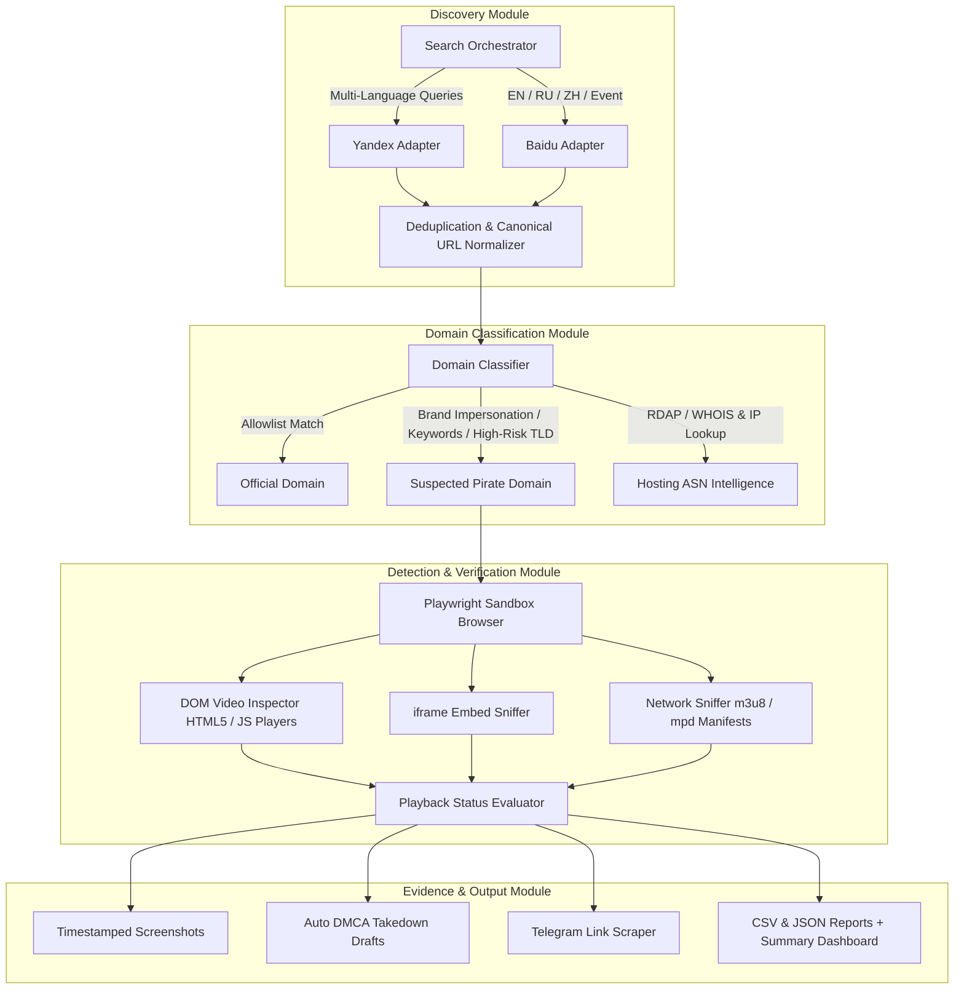

## 1. System Architecture Overview

The Anti-Piracy Discovery & Verification System is designed as a modular, end-to-end automated pipeline to discover illegal live streams across regional search engines (Yandex & Baidu), classify domain legitimacy, verify active video playback in a sandboxed headless browser, and produce legally enforceable evidence packages for takedown notices.

### System Flow Diagram



---

## 2. Key Modules & Design Decisions

### Module 1: Search Discovery (`discovery/`)
- **Multi-Engine Support:** Integrates Yandex (Russia/CIS focus) and Baidu (China focus).
- **Adaptability:** Operates via SerpApi (when `SERPAPI_API_KEY` is present), direct SERP HTML scraping, or built-in fallback parser to handle search engine anti-bot challenges gracefully.
- **Deduplication:** Aggregates multi-language query results and deduplicates by canonical URL structure and domain name to prevent redundant verification.

### Module 2: Domain Classification (`classification/`)
- **Allowlist Filtering:** Checks candidate domains against an extensible allowlist (`dazn.com`, `kayosports.com.au`, `foxtel.com.au`, `binge.com.au`, official social accounts, app stores, Wikipedia, and verified media news sites).
- **Heuristic Scoring Model (0–100):** Evaluates non-allowlisted domains based on:
  - Brand Impersonation (e.g., `dazn-live.xyz`, `watchdazn.com`): **+50 pts**
  - High-Risk TLDs (`.xyz`, `.top`, `.stream`, `.cc`, `.ru`, `.cn`): **+20 pts**
  - Piracy Keywords in Domain / URL / Title / Snippet (`free`, `stream`, `iptv`, `zhibo`, `m3u8`): **+15 to +35 pts**
- **Classification Thresholds:**
  - `Confidence >= 40`: **Pirate**
  - `Confidence 20–39`: **Uncertain**
  - `Confidence < 20`: **Official**
- **Network Intelligence (Bonus):** Performs IP resolution and RDAP/ASN lookup (e.g. Cloudflare, Fastly, bulletproof host identification) for takedown routing.

### Module 3 & 4: Playwright Video Player Detection & Evidence (`detection/`, `evidence/`)
- **Sandboxed Execution:** Headless Chromium instance blocks known pop-up / ad networks for security and speed.
- **Player Types Detected:** HTML5 `<video>`, iframe embeds (`vidsrc`, `streamtape`, etc.), and JS player libraries (`JW Player`, `Video.js`, `Clappr`, `hls.js`, `Flowplayer`, `Plyr`).
- **Network Stream Sniffing:** Intercepts outgoing request traffic to detect `.m3u8` (HLS) and `.mpd` (DASH) live streaming manifests during page render.
- **Playback Validation:** Measures `currentTime` advancement over time or presence of active streaming manifest segments to distinguish between `Player Present - Not Playing` vs `Player Present - Playing`.
- **Evidence Capture:** Takes full-page and cropped player screenshots with UTC timestamping, extracts primary stream URLs, generates DMCA notices, and identifies associated Telegram link channels.

---

## 3. High-Throughput Scaling Architecture (1,000+ URLs in 2 Hours)

To scale from prototype to production handling **1,000+ URLs in 2 hours (~8-9 URLs/sec)**, the system would be architected as follows:

```
[SERP Discovery Cron / API] ──> [Redis Queue / RabbitMQ] ──> [Celery / Worker Pool (10-20 Nodes)]
                                                                    │
                                                     ┌──────────────┴──────────────┐
                                                     ▼                             ▼
                                          [Async Playwright Cluster]      [PostgreSQL / S3 Evidence]
```

### Key Scaling Strategies:
1. **Containerized Sandbox Deployment (Docker / Kubernetes):**
   - The pipeline runs inside an isolated Docker container based on `mcr.microsoft.com/playwright/python`.
   - Protects production infrastructure against malicious web scripts, exploit payloads, and drive-by downloads on unknown pirate streaming sites.
   - Mounted volume volumes (`/app/outputs`) persist output CSV/JSON reports, timestamped screenshot evidence, and auto-generated DMCA takedown notice drafts back to host storage or S3 buckets.

2. **Concurrency & Worker Pools:**
   - Use `asyncio` with Playwright `BrowserContext` pooling (reusing browser instances across requests rather than launching a new browser process per URL).
   - Horizontal scaling via Docker container worker nodes managed by Kubernetes (K8s) or AWS ECS.

3. **Distributed Job Queueing:**
   - Decouple Discovery from Verification using **Celery + Redis** or AWS SQS.
   - Priority queues: Fast-path allowlist domains vs heavy Playwright player checks.

4. **Caching & Deduplication:**
   - **Redis Cache Layer:** Cache domain classification results (TTL: 24 hours). Known official or defunct domains do not re-trigger headless browser checks.

5. **Proxy & Geo-Location Strategy:**
   - Residential and datacenter proxy rotation (e.g., BrightData / Oxylabs) to bypass geo-restrictions for regional streams (Russia, China, EU).

6. **Storage & Evidence Management:**
   - Evidence screenshots stored directly in AWS S3 or Google Cloud Storage with presigned URLs.
   - Structured results stored in PostgreSQL with Elasticsearch for rapid domain querying and historical threat tracking.

---

## 4. Key Assumptions & Constraints

- Search engines may enforce CAPTCHAs or rate limits; the module falls back to fallback SERP parsers or SerpApi to guarantee execution reliability.
- Live stream detection relies on DOM state and network traffic within a 5-10 second inspection window per page.
- All browsing is strictly sandboxed inside Docker container instances without downloading executables or triggering third-party popups.
